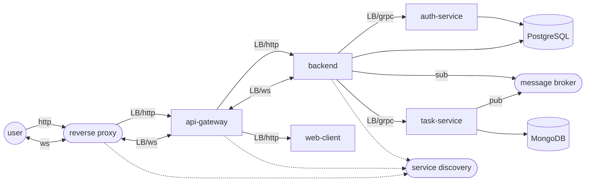

# Dark Deeds

[](https://github.com/gerrkoff/dark-deeds/actions)
[](https://github.com/gerrkoff/dark-deeds/commits/master)
[](https://github.com/gerrkoff/dark-deeds/tags)

Single-Page App on **React & Redux** consuming **ASP.NET Core** services over **PostgreSQL & MongoDB** database

## Hands-on experience

https://dark-deeds.com/

```
Username: sandbox
Password: S@ndb0x
```

## Architecture overview


